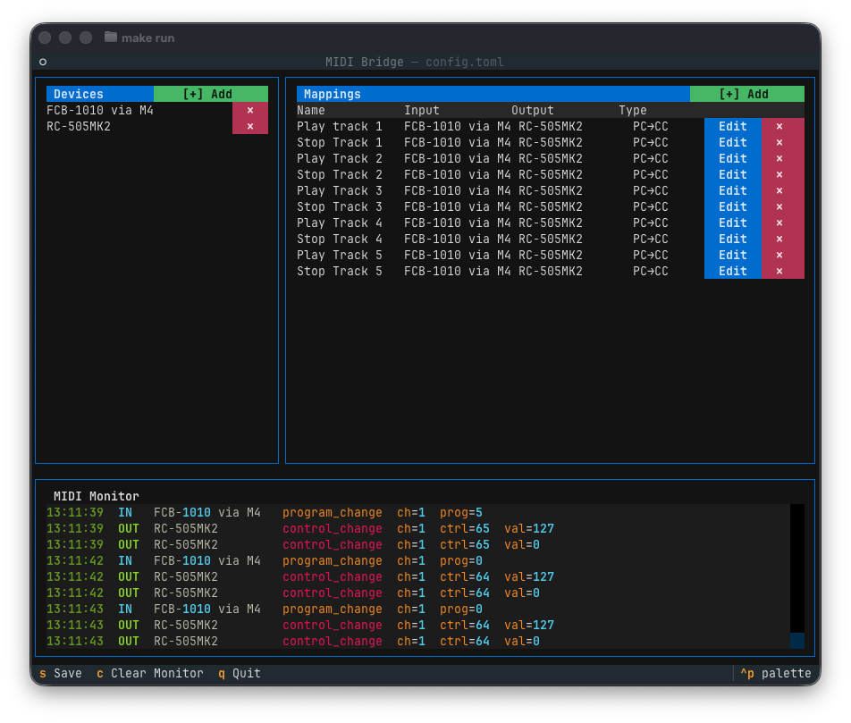
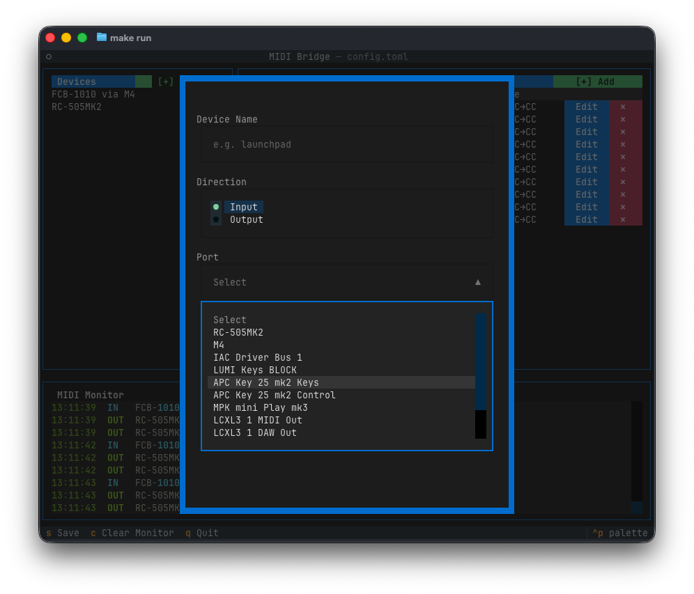
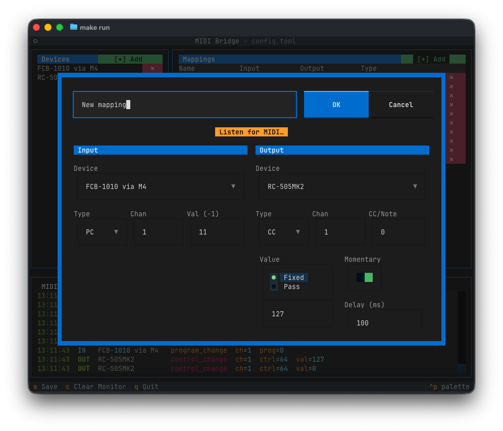

# MIDI Bridge

A terminal UI for routing and transforming MIDI messages between devices. Define mappings (e.g. Program Change in → CC out, with optional momentary behaviour) that run live while the app is open. Config is persisted to a human-readable TOML file.



## Requirements

- Python 3.11+
- [uv](https://docs.astral.sh/uv/)
- A working MIDI setup (or the macOS IAC Driver for software-only testing)

## Install & run

```sh
git clone <repo>
cd midi-bridge
uv run midi-bridge
```

To use a config file at a custom path:

```sh
uv run midi-bridge --config ~/my-setup.toml
```

## Usage

On first launch the app opens with no devices or mappings configured.

### Adding a device

1. Click **[+] Add** in the Devices panel header.
2. Enter a short name (used to reference this device in mappings).
3. Select the MIDI port from the dropdown — only ports currently visible to the OS appear.
4. Choose **Input** or **Output** and press **OK**.



The engine opens the port immediately; no restart needed.

### Adding a mapping

1. Click **[+] Add** in the Mappings panel header.
2. Fill in the form:
   - **Input Device / Type / Channel / Value** — what to listen for (`-1` in the value field matches any value)
   - **Output Device / Type / Channel / Control / Value** — what to send
   - **Momentary** — if enabled, a follow-up zero-value message is sent after the configured delay
3. Press **OK**. Use **Listen for MIDI…** to auto-fill the input fields from the next incoming message.



Click **Edit** or **✕** on any mapping row to modify or remove it. Changes take effect instantly.

### Saving

Press **S** to write the current config to `config.toml` (or the path given with `--config`). The file is reloaded automatically on the next launch.

### Key bindings

| Key | Action |
|-----|--------|
| `S` | Save config |
| `Q` | Quit |

## Config format

`config.toml` is a standard TOML file you can also edit by hand:

```toml
[devices]
launchpad = { port = "Launchpad Pro MK3 MIDI 1", direction = "input" }
synth     = { port = "Hydrasynth MIDI",           direction = "output" }

[[mappings]]
name               = "Patch select -> momentary CC"
input_device       = "launchpad"
input_type         = "program_change"   # program_change | control_change | note_on | note_off | sysex
input_channel      = 1
input_value        = 5                  # program / CC / note number; -1 = any
output_device      = "synth"
output_type        = "control_change"
output_channel     = 1
output_control     = 64                 # CC number (for CC output) or note number (for note output)
output_value       = 127
momentary          = true
momentary_delay_ms = 100
```

## Testing without hardware (macOS)

Enable the IAC Driver in **Audio MIDI Setup → MIDI Studio → IAC Driver → Device is online**. The IAC Bus ports will then appear in the Add Device dropdown, letting you route MIDI between apps on the same machine (e.g. a DAW sending to MIDI Bridge and receiving its output).

## Project structure

```
src/midi_bridge/
├── __main__.py   # entry point
├── models.py     # DeviceConfig, Mapping, AppConfig dataclasses
├── config.py     # TOML load/save
├── engine.py     # MIDI routing engine (background threads)
└── app.py        # Textual TUI
```
